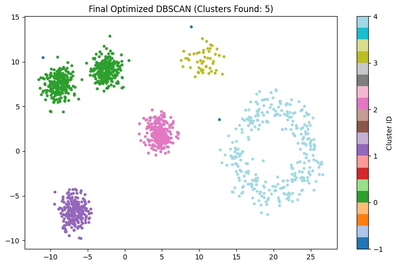

# Machine-Learning-Clustering-Project

# Unsupervised Learning: Comparative Clustering Analysis
**Author:** Dmitri Antonov  
**Course:** Introduction to Machine Learning  

---

## 📌 Project Executive Summary
This project evaluates three fundamental clustering paradigms—Centroid-based, Hierarchical, and Density-based—applied to a complex synthetic dataset featuring non-linear geometric structures. The objective was to optimize hyper-parameters to achieve precise cluster separation while managing noise effectively.

## 🛠 Technical Stack & Preprocessing
* **Libraries:** `Scikit-Learn`, `Pandas`, `Matplotlib`, `Seaborn`.
* **Experiment Tracking:** Comprehensive logging of **65 iterations** using `MLFlow` to monitor metrics and parameters.
* **Data Scaling:** Implemented `StandardScaler` to ensure unit variance across features, a critical step for distance-calculated algorithms like K-Means and DBSCAN.

## 🧪 Experimental Analysis & Methodology
The study followed a rigorous Grid Search approach across the following algorithms:

1. **K-Means (Centroid-based):** Tested for $K \in [2, 6]$. While reaching a high Silhouette Score of **0.725**, it inherently assumed spherical clusters, failing to isolate the concentric ring and crescent shapes.
2. **Agglomerative Clustering:** Evaluated via Ward, Average, and Complete linkage. Performance mirrored K-Means in its difficulty with non-linear manifolds.
3. **DBSCAN (Density-based):** **Chosen as the optimal model.** Through iterative fine-tuning ($eps=0.23, min\_samples=10$), this algorithm successfully identified all 6-7 distinct clusters, regardless of their geometric complexity.

## 📊 Visual Results

*Figure 1: Final DBSCAN clustering results, successfully isolating non-linear structures and identifying distinct density-based clusters.*

## 📈 Key Findings
- **Metric vs. Visualization:** A high Silhouette Score (K-Means) does not always correlate with geological accuracy in complex datasets.
- **Robustness:** DBSCAN proved most robust against noise and non-spherical data distributions.

## 📂 Repository Structure
- `dimitri_antonov_ex3.ipynb`: Full implementation and MLFlow integration.
- `dimitri_antonov_clustering_results.xlsx`: Complete log of all 65 experimental runs with metrics.
